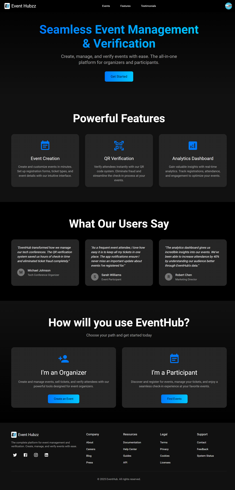

<div id="readme-top" align="center">

  
  <h1>Event Hubzz</h1>

  <p>Event Management, Analytics and Verification for your Event! </p>

  <!-- Badges -->
  <p>
    <a href="https://github.com/Adhik-6/Event_Hubzz/graphs/contributors">
      
    </a>
    <a href="https://github.com/Adhik-6/Event_Hubzz">
      
    </a>
    <a href="https://github.com/Adhik-6/Event_Hubzz/network/members">
      
    </a>
    <a href="https://github.com/Adhik-6/Event_Hubzz/stargazers">
      
    </a>
    <a href="https://github.com/Adhik-6/Event_Hubzz/issues/">
      
    </a>
    <a href="https://github.com/Adhik-6/Event_Hubzz/blob/master/LICENSE">
      
    </a>
  </p>

  <!-- Links -->
  <h4>
    <a href="https://event-hubzz.onrender.com">View Site</a>
    <span> · </span>
    <a href="https://github.com/Adhik-6/Event_Hubzz">Documentation</a>
    <span> · </span>
    <a href="https://github.com/Adhik-6/Event_Hubzz/issues/">Report Bug</a>
    <span> · </span>
    <a href="https://github.com/Adhik-6/Event_Hubzz/issues/">Request Feature</a>
  </h4>

</div>

<p align="center">Event Hubzz is a powerful event management, verification, and registration platform. It enables users to register for events and allows organizers to manage events, verify registrations using QR codes, view analytics, and export event data to Excel.</p>

<br />


<!-- Table of Contents -->
# :notebook_with_decorative_cover: Table of Contents

- [:star2: About the Project](#star2-about-the-project)
  - [:camera: Screenshots](#camera-screenshots)
  - [:space_invader: Tech Stack](#space_invader-tech-stack)
  - [:dart: Features](#dart-features)
  - [:key: Environment Variables](#key-environment-variables)
- [:toolbox: Getting Started](#toolbox-getting-started)
  - [:bangbang: Prerequisites](#bangbang-prerequisites)
  - [:gear: Installation](#gear-installation)
  - [:running: Run Locally](#running-run-locally)
- [:memo: TODOs & Planned Features](#memo-todos--planned-features)
- [:wave: Contributing](#wave-contributing)
  - [:medal_sports: Top contributors](#medal_sports-top-contributors)
- [:grey_question: FAQ](#grey_question-faq)
- [:warning: License](#warning-license)
- [:handshake: Contact](#handshake-contact)
- [:package: External Tools & Libraries](#package-external-tools--libraries)
- [:gem: Acknowledgements](#gem-acknowledgements)


<!-- About the Project -->
## :star2: About the Project

Event Hubzz is a full-featured event management and analytics platform designed to simplify the way events are organized, managed, and attended. It provides organizers with powerful tools to create events, build custom registration forms (or integrate external ones like Google Forms), and track participation with real-time analytics.

Participants can seamlessly register for events and receive QR codes for verification, while organizers can quickly validate entries using the dedicated Flutter-based scanner app. With features like Excel export, profile management, and a secure backend, Event Hubzz ensures both flexibility and reliability.

Whether you're hosting small workshops or large conferences, Event Hubzz streamlines the entire process—from registration to verification—making event management effortless and efficient.

<!-- Screenshots -->
### :camera: Screenshots

<div align="center" style="margin-bottom: 80px;">
  <div style="margin-bottom: 40px;">
    <h3>Landing Page</h3>
    
  </div>
</div>


> 📁 More screenshots are available in the [screenshots folder](./screenshots)


<!-- TechStack -->
### :space_invader: Tech Stack

* [![React][React.js]][React-url]
* [![MUI][MUI]][MUI-url]
* [![Node.js][Node.js]][Node-url]
* [![MongoDB][MongoDB]][MongoDB-url]
* [![Flutter][Flutter]][Flutter-url]
* [![Firebase][Firebase]][Firebase-url]
* [![Cloudinary][Cloudinary]][Cloudinary-url]
* [![V0][V0]][V0-url]


### :dart: Features

- Event registration system
- Analytics dashboard per event
- Build a custom registration form or use an external URL (e.g., Google Forms)
- Download registration details as Excel
- QR code-based verification system for participants
- User profile management
- Dedicated Flutter app for organizers to scan and verify registrations

<!-- Getting Started -->
##  :toolbox: Getting Started

<!-- Prerequisites -->
### :bangbang: Prerequisites

- Node.js
- Git

<!-- Env Variables -->
### :key: Environment Variables

To run this project, you will need to add the following environment variables to your .env file

```env
PORT
VITE_PORT
CLIENT_URL_DEV=http://localhost:5173
SERVER_URL_DEV=http://localhost:8000
CLIENT_URL
SERVER_URL
VITE_SERVER_URL=http://localhost:
MONGO_URI
MAIL_ID
MAIL_PASS
CLOUDINARY_CLOUD_NAME
CLOUDINARY_API_KEY
CLOUDINARY_API_SECRET
JWT_SECRET
```

### :gear: Installation

This project uses npm as package manager

1. Clone the repository:
  ```bash
  git clone https://github.com/Adhik-6/Event_Hubzz.git
  cd event-hubzz
  ```

2. Install dependencies and build:
  ```bash
  npm run build:dev
  ```

<!-- Run Locally -->
### :running: Run Locally

1. Start the backend server:
  ```bash
  npm run dev
  ```

2. Open another terminal and start the frontend:
  ```bash
  npm run dev --prefix client
  ```

3. Visit the URL shown in the second terminal (usually `http://localhost:5173`).


## :memo: TODOs & Planned Features

- [ ] DB
  - [ ] Store QR code in Cloudinary or MongoDB as buffer/base64 for easy access.
  - [ ] If possible try renaming the "User" mongoDB model into "Response"
  - [ ] Auto-remove events older than one month.
- [ ] Event Creation
  - [ ] Prompt for additional info during event creation.
  - [ ] Prevent duplicate events to be created.
  - [ ] In createEvent page > eventDetails component, let the user know invalid inputs.
- [ ] In Registration Table
  - [ ] Debounce search 
  - [ ] Also the Date & Time questions are not searchable (though they are searchable in YYYY-MM-DD & HH:MM format)
  - [ ] Add "view only selected column" feature in table
- [ ] Free vs Paid event registration, and filtering based on it.
- [ ] Public user profile pages to let other users see one's profile.
- [ ] Bind active step with URL; persist states.
- [ ] Show different answers give to different questions of type 'multiline' and 'text' in analytics' questions section
- [ ] Set up Notifications tab in user profile
- [ ] Add Forgot password functionality
- [ ] Implement backend-based sorting by adding queries to the request URL
- [ ] Use some other libraries instead of xlsx(SheetJS)

<!-- CONTRIBUTING -->
## :wave: Contributing

Contributions are what make the open source community such an amazing place to learn, inspire, and create. Any contributions you make are **greatly appreciated**.

If you have a suggestion that would make this better, please fork the repo and create a pull request. You can also simply open an issue with the tag "enhancement".
Don't forget to give the project a star! Thanks again!

1. Fork the Project
2. Create your Feature Branch (`git checkout -b feature/AmazingFeature`)
3. Commit your Changes (`git commit -m 'Add some AmazingFeature'`)
4. Push to the Branch (`git push origin feature/AmazingFeature`)
5. Open a Pull Request


### :medal_sports: Top contributors:

<a href="https://github.com/Adhik-6/Event_Hubzz/graphs/contributors">
  
</a>


<!-- FAQ -->
## :grey_question: FAQ

**Q: Can I register for any events?**  
Yes, Event Hubzz supports registration for all types of events.

**Q: What if I lose my QR code?**  
The QR will be sent to your mail. So you can get it from there. Also you can contact the support.

**Q: How do organizers verify users?** 
Using the official Event Hubzz QR Scanner App built with Flutter.

**Q: Can I use Google Forms instead of the built-in form builder?**  
Absolutely! You can integrate external forms seamlessly. Though some analytics features will not be shown.


<!-- License -->
## :warning: License

Distributed under the no License.

> Though there is no license I would suggest that you don't use this project for  **commercial** purpose.

<!-- Contact -->
## :handshake: Contact

Email - <a href="mailto:adhik.m10a@gmail.com">adhik.m10a@gmail.com</a>
LinkedIn - [adhik-igthishaam](https://linkedin.com/in/adhik-igthishaam)

<!-- Acknowledgments -->
## :gem: Acknowledgements

 - [Vercel AI (v0)](https://v0.dev/)
 - [Firebase Studio (App)](https://studio.firebase.google.com/)
 - [ChatGPT](https://chatgpt.com/)
 - [Gemini](https://https://gemini.google.com/)
 - [Shields.io](https://shields.io/)
 - [Awesome README](https://github.com/matiassingers/awesome-readme)
 - [Emoji Cheat Sheet](https://github.com/ikatyang/emoji-cheat-sheet/blob/master/README.md#travel--places)
 - [Readme Template](https://github.com/othneildrew/Best-README-Template)


<p align="right">(<a href="#readme-top">back to top</a>)</p>


[React.js]: https://img.shields.io/badge/React-20232A?style=for-the-badge&logo=react&logoColor=61DAFB
[React-url]: https://reactjs.org/

[MUI]: https://img.shields.io/badge/MUI-007FFF?style=for-the-badge&logo=mui&logoColor=white
[MUI-url]: https://mui.com/

[Node.js]: https://img.shields.io/badge/Node.js-339933?style=for-the-badge&logo=node.js&logoColor=white
[Node-url]: https://nodejs.org/

[MongoDB]: https://img.shields.io/badge/MongoDB-47A248?style=for-the-badge&logo=mongodb&logoColor=white
[MongoDB-url]: https://www.mongodb.com/

[Flutter]: https://img.shields.io/badge/Flutter-02569B?style=for-the-badge&logo=flutter&logoColor=white
[Flutter-url]: https://flutter.dev/

[Firebase]: https://img.shields.io/badge/Firebase-FFCA28?style=for-the-badge&logo=firebase&logoColor=black
[Firebase-url]: https://firebase.google.com/

[Cloudinary]: https://img.shields.io/badge/Cloudinary-3448C5?style=for-the-badge&logo=cloudinary&logoColor=white
[Cloudinary-url]: https://cloudinary.com/

[V0]: https://img.shields.io/badge/V0%20(Vercel%20AI)-000000?style=for-the-badge&logo=vercel&logoColor=white
[V0-url]: https://v0.dev/
