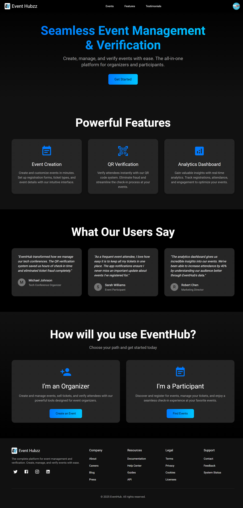
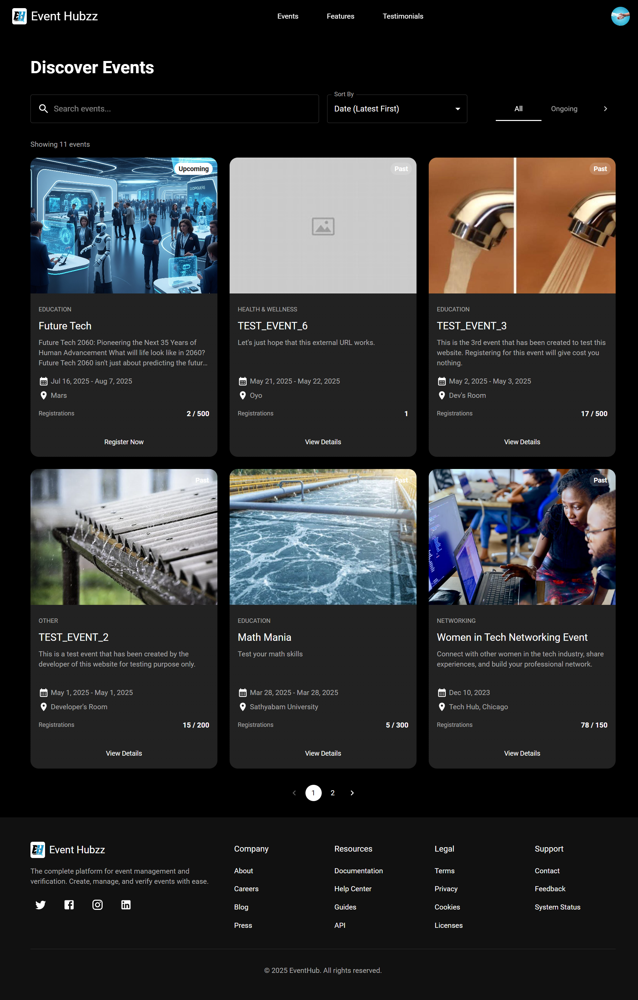
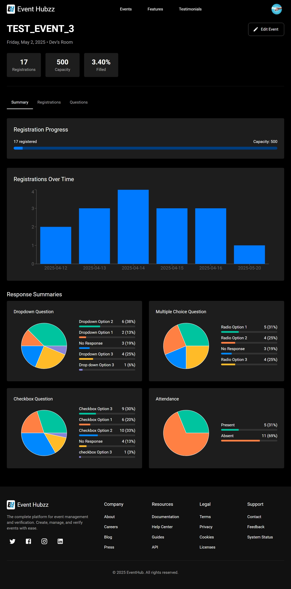
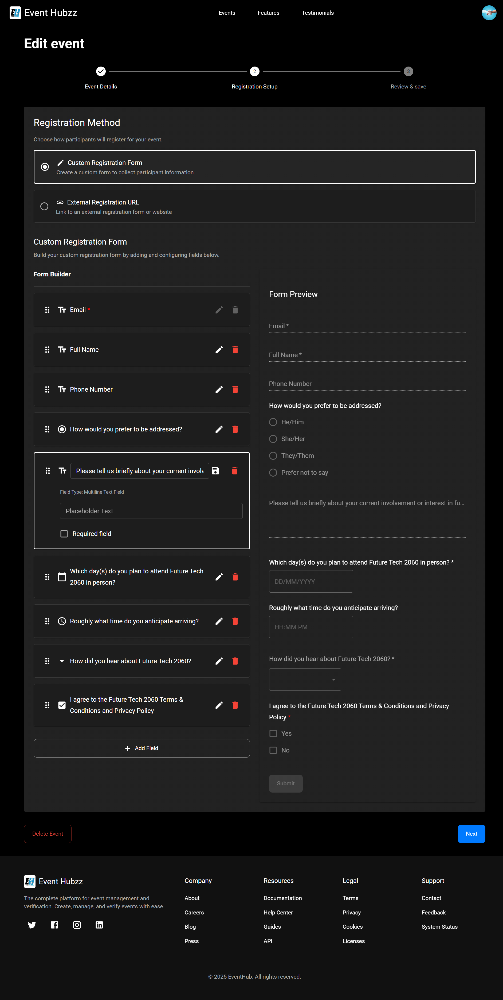
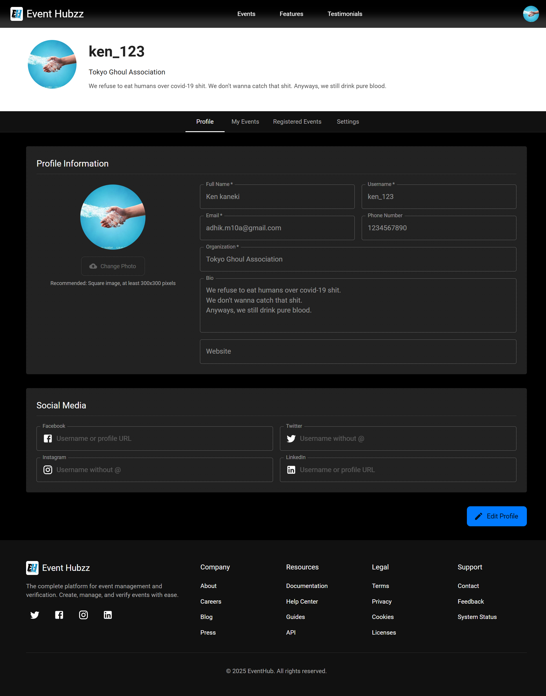
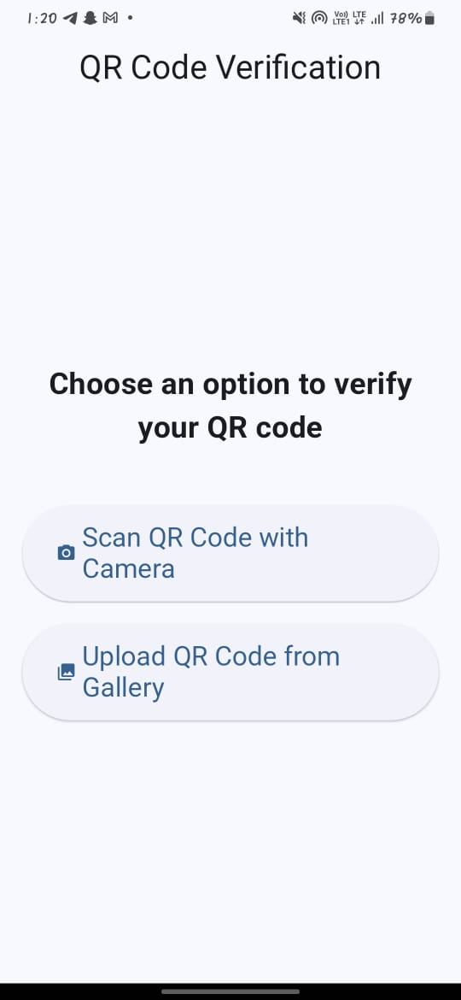

<div align="center">

  
  <h1>Event Hubzz</h1>
  
  <p>Event Management, Analytics and Verification for you Event! </p>
  
  
   <!-- Badges -->
   <p>
   <a href="https://github.com/Adhik-6/Event_Hubzz/graphs/contributors">
      
   </a>
   <a href="">
      
   </a>
   <a href="https://github.com/Adhik-6/Event_Hubzz/network/members">
      
   </a>
   <a href="https://github.com/Adhik-6/Event_Hubzz/stargazers">
      
   </a>
   <a href="https://github.com/Adhik-6/Event_Hubzz/issues/">
      
   </a>
   <a href="https://github.com/Adhik-6/Event_Hubzz/blob/master/LICENSE">
      
   </a>
   </p>
   
   <!-- Links -->
   <h4>
      <a href="https://github.com/Adhik-6/Event_Hubzz/">View Demo</a>
  <span> · </span>
      <a href="https://github.com/Adhik-6/Event_Hubzz">Documentation</a>
  <span> · </span>
      <a href="https://github.com/Adhik-6/Event_Hubzz/issues/">Report Bug</a>
  <span> · </span>
      <a href="https://github.com/Adhik-6/Event_Hubzz/issues/">Request Feature</a>
  </h4>

</div>

<br />

[](https://creativecommons.org/licenses/by-nc/4.0/)


Event Hubzz is a powerful event management, verification, and registration platform. It enables users to register for events and allows organizers to manage events, verify registrations using QR codes, view analytics, and export event data to Excel.

<!-- Table of Contents -->
# :notebook_with_decorative_cover: Table of Contents


<!-- About the Project -->
## :star2: About the Project

<!-- Screenshots -->
### :camera: Screenshots

<div align="center"> 
  
</div>
<div align="center"> 
  
</div>
<div align="center"> 
  
</div>
<div align="center"> 
  
</div>
<div align="center"> 
  
</div>
<div align="center"> 
  
</div>

> 📁 More screenshots are available in the [screenshots folder](./screenshots)


<!-- TechStack -->
### :space_invader: Tech Stack

<details>
  <summary>Client</summary>
  <ul>
    <li><a href="https://www.typescriptlang.org/">Typescript</a></li>
    <li><a href="https://nextjs.org/">Next.js</a></li>
    <li><a href="https://reactjs.org/">React.js</a></li>
    <li><a href="https://tailwindcss.com/">TailwindCSS</a></li>
  </ul>
</details>

<details>
  <summary>Server</summary>
  <ul>
    <li><a href="https://www.typescriptlang.org/">* [![Next][Next.js]][Next-url]</a></li>
    <li><a href="https://expressjs.com/">Express.js</a></li>
    <li><a href="https://go.dev/">Golang</a></li>
    <li><a href="https://nestjs.com/">Nest.js</a></li>
    <li><a href="https://socket.io/">SocketIO</a></li>
    <li><a href="https://www.prisma.io/">Prisma</a></li>    
    <li><a href="https://www.apollographql.com/">Apollo</a></li>
    <li><a href="https://graphql.org/">GraphQL</a></li>
  </ul>
</details>

<details>
<summary>Database</summary>
  <ul>
    <li><a href="https://www.mysql.com/">MySQL</a></li>
    <li><a href="https://www.postgresql.org/">PostgreSQL</a></li>
    <li><a href="https://redis.io/">Redis</a></li>
    <li><a href="https://neo4j.com/">Neo4j</a></li>
    <li><a href="https://www.mongodb.com/">MongoDB</a></li>
  </ul>
</details>

<details>
<summary>DevOps</summary>
  <ul>
    <li><a href="https://www.docker.com/">Docker</a></li>
    <li><a href="https://www.jenkins.io/">Jenkins</a></li>
    <li><a href="https://circleci.com/">CircleCLI</a></li>    
  </ul>
</details>

* [![Next][Next.js]][Next-url]
* [![React][React.js]][React-url]
* [![Vue][Vue.js]][Vue-url]
* [![Angular][Angular.io]][Angular-url]
* [![Svelte][Svelte.dev]][Svelte-url]
* [![Laravel][Laravel.com]][Laravel-url]
* [![Bootstrap][Bootstrap.com]][Bootstrap-url]
* [![JQuery][JQuery.com]][JQuery-url]


### :dart: Features

- Event registration system
- Analytics dashboard per event
- Build a custom registration form or use an external URL (e.g., Google Forms)
- Download registration details as Excel
- QR code-based verification system for participants
- User profile management
- Dedicated Flutter app for organizers to scan and verify registrations


## 🛠️ Tech Stack

| Platform       | Technologies Used                                |
|----------------|--------------------------------------------------|
| Frontend       | React + Vite, Material UI                        |
| Backend        | Node.js, Express                                 |
| Database       | MongoDB                                          |
| Mobile App     | Flutter, Dart                                    |
| Other Services | Firebase Studio, Cloudinary, Nodemailer, Recharts, v0 (Vercel AI) |


<!-- Env Variables -->
### :key: Environment Variables

To run this project, you will need to add the following environment variables to your .env file

`PORT=`
`VITE_PORT=`
`CLIENT_URL_DEV=http://localhost:5173`
`SERVER_URL_DEV=http://localhost:8000`
`CLIENT_URL=`
`SERVER_URL=`
`VITE_SERVER_URL=http://localhost:`
`MONGO_URI=`
`MAIL_ID=`
`MAIL_PASS=`
`CLOUDINARY_CLOUD_NAME=`
`CLOUDINARY_API_KEY=`
`CLOUDINARY_API_SECRET=`
`JWT_SECRET=`

---

<!-- Getting Started -->
##  :toolbox: Getting Started

<!-- Prerequisites -->
### :bangbang: Prerequisites

- Node.js
- Git

### :gear: Installation

This project uses npm as package manager

1. Clone the repository:
```bash
git clone https://github.com/Adhik-6/Event_Hubzz.git
cd event-hubzz
```

2. Install dependencies and build:
```bash
npm run build:dev
```

<!-- Run Locally -->
### :running: Run Locally

1. Start the backend server:
```bash
npm run dev
```

2. Open another terminal and run the frontend:
```bash
npm run dev --prefix client
```

3. Visit the URL shown in the second terminal (usually `http://localhost:5173`).


## 🔍 TODOs & Planned Features

- [ ] DB
  - [ ] Store QR code in Cloudinary or MongoDB as buffer/base64 for easy access.
  - [ ] If possible try renaming the "User" mongoDB model into "Response"
  - [ ] Auto-remove events older than one month.
- [ ] Event Creation
  - [ ] Prompt for additional info during event creation.
  - [ ] Prevent duplicate events to be created.
  - [ ] In createEvent page > eventDetails component, let the user know invalid inputs.
- [ ] Free vs Paid event registration, and filtering based on it.
- [ ] Public user profile pages to let other users see one's profile.
- [ ] Bind active step with URL; persist states.
- [ ] Show different answers give to different questions of type 'multiline' and 'text' in analytics' questions section
- [ ] In Registration Table
  - [ ] Debounce search 
  - [ ] Also the Date & Time questions are not searchable (though they are searchable in YYYY-MM-DD & HH:MM format)
  - [ ] Add "view only selected column" feature in table
- [ ] Set up Notifications tab in user profile
- [ ] Add Forgot password functionality
- [ ] Implement backend-based sorting by adding queries to the request URL

<!-- CONTRIBUTING -->
## :wave: Contributing

Contributions are what make the open source community such an amazing place to learn, inspire, and create. Any contributions you make are **greatly appreciated**.

If you have a suggestion that would make this better, please fork the repo and create a pull request. You can also simply open an issue with the tag "enhancement".
Don't forget to give the project a star! Thanks again!

1. Fork the Project
2. Create your Feature Branch (`git checkout -b feature/AmazingFeature`)
3. Commit your Changes (`git commit -m 'Add some AmazingFeature'`)
4. Push to the Branch (`git push origin feature/AmazingFeature`)
5. Open a Pull Request


### Top contributors:

<a href="https://github.com/othneildrew/Best-README-Template/graphs/contributors">
  
</a>

<p align="right">(<a href="#readme-top">back to top</a>)</p>


<!-- FAQ -->
## :grey_question: FAQ

**Q: Can I register for any events?**  
Yes, Event Hubzz supports registration for all types of events.

**Q: What if I lose my QR code?**  
The QR will be sent to your mail. So you can get it from there. Also you can contact the support.

**Q: How do organizers verify users?** 
Using the official Event Hubzz QR Scanner App built with Flutter.

**Q: Can I use Google Forms instead of the built-in form builder?**  
Absolutely! You can integrate external forms seamlessly. Though some analytics features will not be shown.


<!-- License -->
## :warning: License

This project is licensed under the **Creative Commons Attribution-NonCommercial 4.0 International (CC BY-NC 4.0)** license.

> You are free to use and share this project **non-commercially**. For full license terms, [click here](https://creativecommons.org/licenses/by-nc/4.0/).

<!-- Contact -->
## :handshake: Contact

Your Name - [@twitter_handle](https://twitter.com/twitter_handle) - email@email_client.com


## 📦 External Tools & Libraries

- **Cloudinary** – store QR codes and other media
- **Firebase Studio** – build and manage Flutter apps
- **v0 by Vercel** – AI-powered frontend generation

<!-- Acknowledgments -->
## :gem: Acknowledgements

 - [Vercel AI](https://v0.dev/)
 - [Firebase Studio](https://studio.firebase.google.com/)
 - [Cloudinary](https://cloudinary.com/)


[Next.js]: https://img.shields.io/badge/next.js-000000?style=for-the-badge&logo=nextdotjs&logoColor=white
[Next-url]: https://nextjs.org/
[React.js]: https://img.shields.io/badge/React-20232A?style=for-the-badge&logo=react&logoColor=61DAFB
[React-url]: https://reactjs.org/
[Vue.js]: https://img.shields.io/badge/Vue.js-35495E?style=for-the-badge&logo=vuedotjs&logoColor=4FC08D
[Vue-url]: https://vuejs.org/
[Angular.io]: https://img.shields.io/badge/Angular-DD0031?style=for-the-badge&logo=angular&logoColor=white
[Angular-url]: https://angular.io/
[Svelte.dev]: https://img.shields.io/badge/Svelte-4A4A55?style=for-the-badge&logo=svelte&logoColor=FF3E00
[Svelte-url]: https://svelte.dev/
[Laravel.com]: https://img.shields.io/badge/Laravel-FF2D20?style=for-the-badge&logo=laravel&logoColor=white
[Laravel-url]: https://laravel.com
[Bootstrap.com]: https://img.shields.io/badge/Bootstrap-563D7C?style=for-the-badge&logo=bootstrap&logoColor=white
[Bootstrap-url]: https://getbootstrap.com
[JQuery.com]: https://img.shields.io/badge/jQuery-0769AD?style=for-the-badge&logo=jquery&logoColor=white
[JQuery-url]: https://jquery.com 